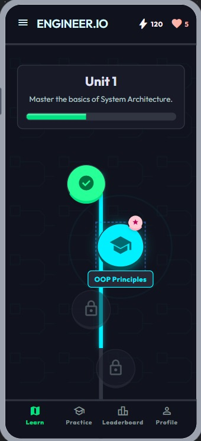
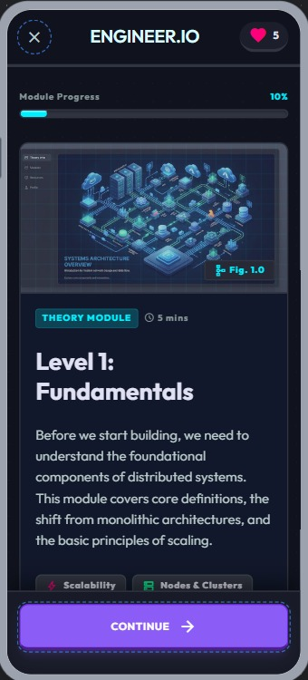
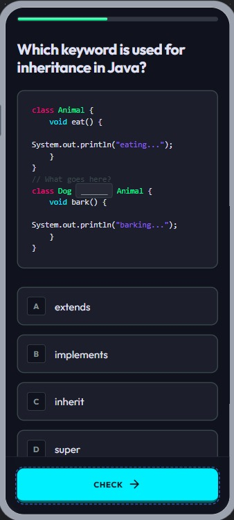
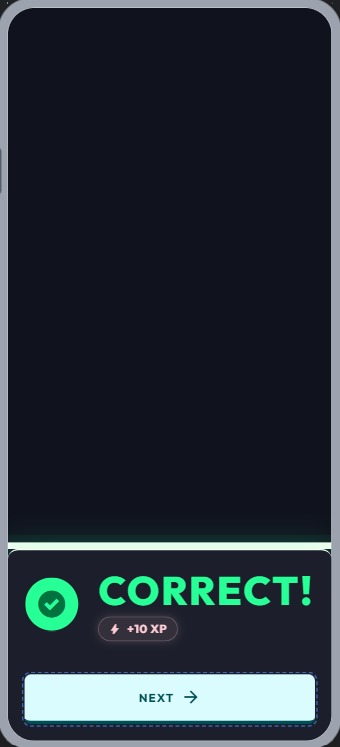

# Diseño de interfaz de usuario

La aplicación tendrá la siguientes pantallas

1. Pantalla 1: Pantalla de niveles

2. Pantalla 2: Pantalla de explicacion

3. Pantalla 3: Preguntas

4. Pantalla. Correcta o Incorrecta

# Referencias

- [Material Design: StitchAI](https://stitch.withgoogle.com/projects/17841960806142934961)
